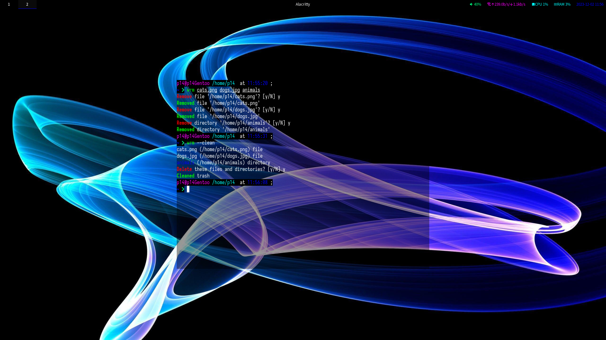

# Wrm - A file deletion utility



## Features
- File will be moved to trash (`$HOME/.config/wrm/trash`) by default if you do not use the option `--delete`.
- Prompt before every actions.
- Explain what is being done.

## Usage
To move files to trash:
```
wrm foo bar ...
```

To delete files:
```
wrm --delete foo bar...
```

To restore files in trash to where they came from:
```
wrm --restore $HOME/.config/trash/foo
```

To list all files and directories in trash:
```
wrm --list
```

To delete all files and directories in trash permanently:
```
wrm --clean
```

### Options
- `-n`, `--noninteractive` - Do not prompt before an action.
- `-q`, `--quiet` - Do not print log messages.

## License
This project is licensed under the MIT License and the Apache-2.0.
